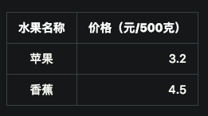

==========================分割线==========================
## 用Jekyll搭建的Github Pages个人博客
### 先占坑

==========================分割线==========================
## 常用命令
### 解析器
添加markdown解析器，在_config.yml里添加

markdown: kramdown


### 字体

**黑体**


*斜体*


<del> 删除体 </del>


### 分隔线

* * *




***


- - -


---


### 引用

> 这里是引用


### 列表
有序列表项前加数字和点（注意前后面要空格）


1. 列表1

2. 列表2



### 表格

|水果名称|价格（元/500克）|
|:-------:|-----:|
|苹果|3.2|
|香蕉|4.5|


### 插入代码

def main():
    print('hello world')


### 数学公式
行内

$$E=mc^2$$


行间

$$
a_{i}
$$


### 插入图片
存在渲染慢的问题







### 脚注

比如[^f1]
[^f1]: 脚注1


### 插入链接

[Jekyll’s GitHub repo][4]
[4]:   https://github.com/jekyll/jekyll


[baidu](http://www.baidu.com)


### Reference

[用Markdown写blog的常用操作][1]  
[Jekyll中使用MathJax][2]  
[Jekyll中文文档][3]  
[用Jekyll搭建的Github Pages个人博客] [4]

<!-- 链接 -->
[1]: http://www.cnblogs.com/mo-wang/p/5117819.html
[2]: http://pkuwwt.github.io/linux/2013-12-03-jekyll-using-mathjax/
[3]: http://jekyllcn.com/
[4]: http://louisly.com/2016/04/used-jekyll-to-create-my-github-blog/
